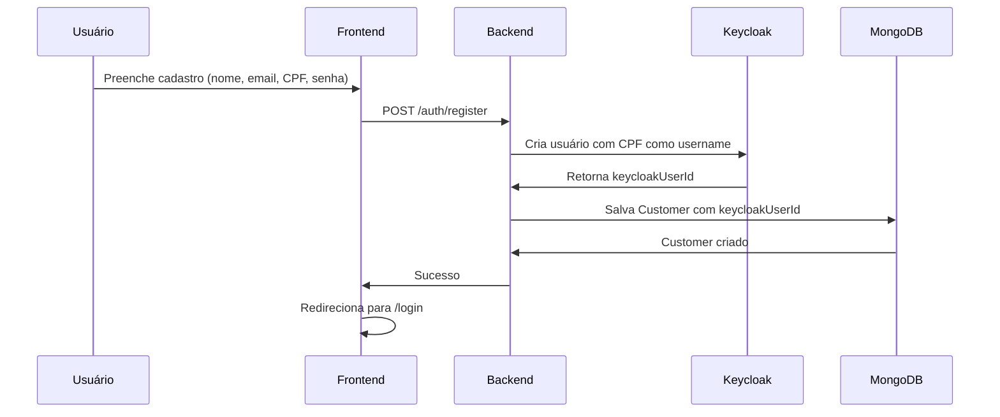
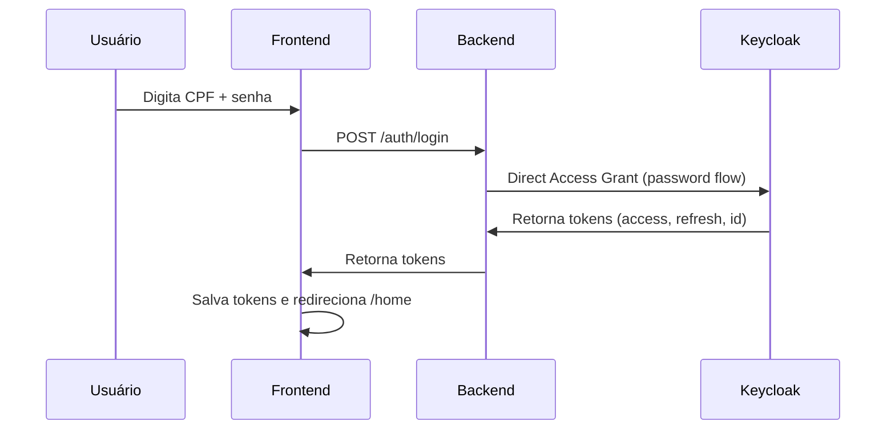
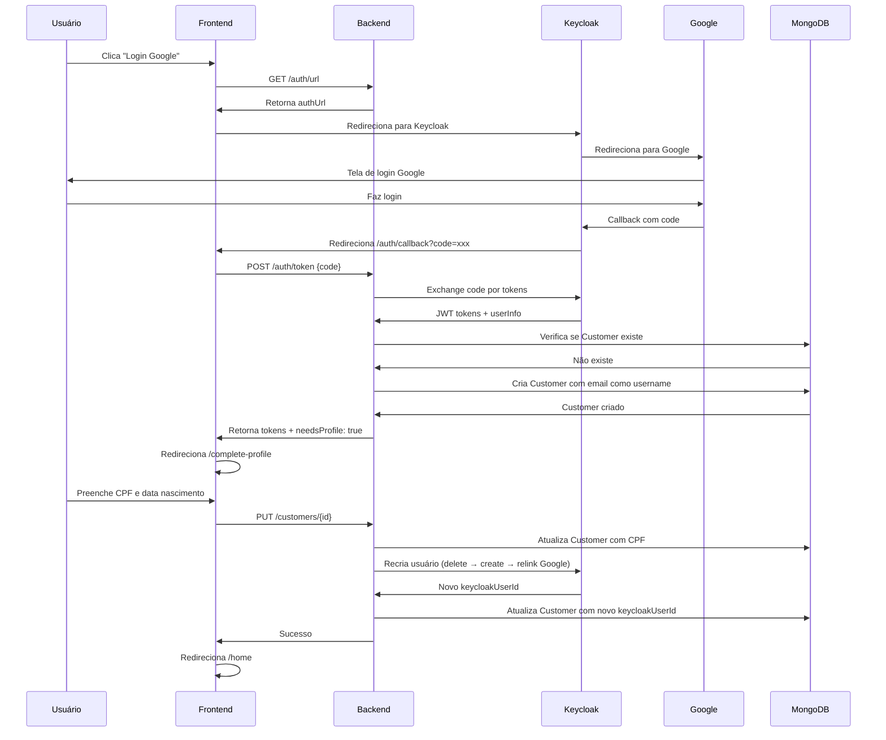
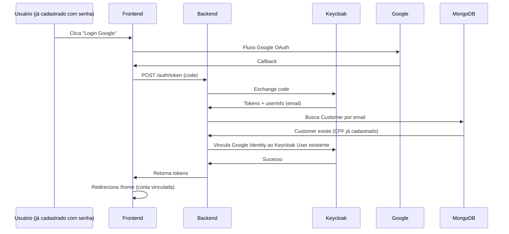

# POC - Autenticação Completa com Keycloak

Este projeto é uma prova de conceito (POC) para autenticação completa (senha + Google OAuth) utilizando Keycloak como Identity Provider, com gerenciamento de usuários e vinculação de contas sociais.

## 🏗️ Arquitetura

```
poc-keycloak/
├── arch/           # Infraestrutura (Docker, Keycloak, PostgreSQL, MongoDB)
├── backend/        # API Spring Boot 3 com Java 21
├── frontend/       # Aplicação Angular 17 standalone
└── README.md       # Esta documentação
```

## 🚀 Tecnologias

### Backend
- **Spring Boot 3** com Java 21
- **Spring Security** para CORS e endpoints
- **Keycloak Admin REST API** para gerenciamento de usuários
- **MongoDB** para persistência de clientes (Customer)
- **OAuth 2.0** (Authorization Code + Direct Access Grant)
- **Arquitetura Clean Code** com SRP aplicado

### Frontend  
- **Angular 17** com standalone components
- **RxJS** para programação reativa
- **Toast System** para notificações
- **Route Guards** para proteção de rotas
- **Modern UI/UX** com animações e responsividade

### Infraestrutura
- **Keycloak 23.0** como Identity Provider
- **PostgreSQL** como banco do Keycloak
- **MongoDB** como banco da aplicação
- **Docker Compose** para orquestração

## 📋 Pré-requisitos

- Docker e Docker Compose
- Java 21
- Node.js 20+
- Maven 3.9+
- MongoDB (via Docker)

## 🏃‍♂️ Como executar

### 1. Iniciar a infraestrutura

```bash
cd arch
./start.sh
```

**Keycloak Admin Console**: http://localhost:8080/admin
- Usuário: `admin` | Senha: `admin`

**MongoDB**: `localhost:27017`
- Usuário: `admin` | Senha: `admin123`

### 2. Iniciar o Backend

```bash
cd backend
./gradlew bootRun
```

**API Backend**: http://localhost:8081

### 3. Iniciar o Frontend

```bash
cd frontend
npm install
npm start
```

**Aplicação Web**: http://localhost:4200

## ✨ Funcionalidades Implementadas

### ✅ Autenticação Dupla
- [x] **Login com senha** (Direct Access Grant)
- [x] **Login com Google** (Authorization Code Flow)
- [x] **Cadastro de usuários** com senha
- [x] **CPF como username** para TODOS os usuários
- [x] **Account Linking** automático (vincula Google a conta existente)

### ✅ Gerenciamento de Usuários
- [x] **Criação de usuários** no Keycloak + MongoDB
- [x] **Atualização de username** (delete-create-relink para federated users)
- [x] **Complete Profile** para usuários sociais (adiciona CPF)
- [x] **Federated Identity Management** (vincular/desvincular Google)
- [x] **Custom Attributes** (CPF, birthDate)

### ✅ Frontend Moderno
- [x] **Tela de login** com senha + Google
- [x] **Tela de cadastro** responsiva
- [x] **Complete Profile** para primeiro login social
- [x] **Toast notifications** para feedback
- [x] **Loading states** durante autenticação
- [x] **Error handling** robusto
- [x] **Route protection** com guards
- [x] **Home dashboard** pós-login

### ✅ Backend Robusto
- [x] **Spring Security** configurado
- [x] **CORS** liberado para desenvolvimento
- [x] **Keycloak Admin API** integration
- [x] **MongoDB** para persistência
- [x] **Clean Code** com SRP aplicado
- [x] **Error handling** centralizado
- [x] **Services especializados** (16+ métodos pequenos)

### ✅ Infraestrutura
- [x] **Keycloak 23.0** configurado
- [x] **PostgreSQL** como database do Keycloak
- [x] **MongoDB** como database da aplicação
- [x] **Docker containers** orquestrados
- [x] **Scripts** de automação (start/stop/reset)

## 🔧 Configuração OAuth Google

Para funcionar completamente, configure no **Google Cloud Console**:

1. Criar projeto no [Google Cloud Console](https://console.cloud.google.com/)
2. Habilitar **Google+ API**
3. Configurar **OAuth Consent Screen**
4. Criar **OAuth 2.0 Client ID** com:
   - **Authorized redirect URIs**: `http://localhost:8080/realms/master/broker/google/endpoint`
5. Anotar **Client ID** e **Client Secret**
6. No Keycloak Admin, configurar **Identity Provider** Google com as credenciais

## 📊 Fluxos de Autenticação

### Fluxo 1: Cadastro com Senha



### Fluxo 2: Login com Senha



### Fluxo 3: Login com Google (Primeiro Acesso)



### Fluxo 4: Login com Google (Account Linking)



## 📁 Estrutura de Arquivos Principais

```
backend/src/main/java/com/example/backend/
├── config/
│   ├── SecurityConfig.java          # Spring Security + CORS
│   ├── RestTemplateConfig.java      # Bean RestTemplate
│   └── KeycloakProperties.java      # Properties do Keycloak
├── controller/
│   ├── AuthorizationController.java # Endpoints de autenticação
│   └── CustomerController.java      # Endpoints de clientes
├── service/
│   ├── AuthorizationService.java    # Service de autenticação (13 métodos)
│   ├── CustomerService.java         # Service de clientes (16 métodos)
│   ├── KeycloakAdminService.java    # Admin REST API (30+ métodos)
│   ├── KeycloakHttpClient.java      # Protocol endpoints
│   ├── KeycloakUrlService.java      # Construção URLs OAuth
│   └── KeycloakLogoutService.java   # Logout logic
├── model/
│   ├── Customer.java                # Entity MongoDB
│   ├── LoginResponse.java           # DTO resposta
│   └── dto/
│       ├── LoginRequestDTO.java     # DTO login com senha
│       └── RegisterRequestDTO.java  # DTO cadastro
└── util/
    └── UrlUtils.java                # Utilitários URLs

frontend/src/app/
├── login/
│   ├── login.component.ts           # Login (senha + Google)
│   ├── login.component.html         # Template moderno
│   ├── login.component.scss         # Estilos responsivos
│   └── service/login.service.ts     # Service de autenticação
├── register/
│   └── register.component.ts        # Cadastro com senha
├── complete-profile/
│   └── complete-profile.component.ts # Completar perfil (CPF)
├── auth-callback/
│   └── auth-callback.component.ts   # Handler OAuth callback
├── home/
│   └── home.component.ts            # Dashboard pós-login
├── shared/
│   ├── services/
│   │   ├── toast.service.ts         # Sistema de notificações
│   │   └── direct-auth.service.ts   # Login com senha
│   ├── components/
│   │   └── toast/toast.component.ts # Componente toast
│   └── interceptors/
│       └── error.interceptor.ts     # Interceptor HTTP
├── auth.guard.ts                    # Proteção de rotas
├── login.guard.ts                   # Redirecionamento se logado
└── app.routes.ts                    # Configuração rotas
```

## 🔍 Endpoints da API

### Autenticação

| Método | Endpoint | Descrição |
|--------|----------|-----------|
| `GET` | `/auth/url` | Obter URL de autenticação Google (OAuth) |
| `POST` | `/auth/register` | Cadastrar novo usuário com senha |
| `POST` | `/auth/login` | Login com CPF/email + senha (Direct Access Grant) |
| `POST` | `/auth/token` | Trocar authorization code por tokens JWT |
| `POST` | `/auth/logout` | Fazer logout e revogar tokens |

### Clientes (Customers)

| Método | Endpoint | Descrição |
|--------|----------|-----------|
| `GET` | `/customers` | Listar todos os clientes |
| `GET` | `/customers/{id}` | Buscar cliente por ID |
| `GET` | `/customers/by-email/{email}` | Buscar cliente por email |
| `GET` | `/customers/by-keycloak/{keycloakUserId}` | Buscar cliente por keycloakUserId |
| `POST` | `/customers` | Criar novo cliente |
| `PUT` | `/customers/{id}` | Atualizar cliente (CPF, nome, data nascimento) |

## 📚 Documentação Adicional

- [Configuração de Infraestrutura](./arch/README.md)
- [Documentação do Backend](./backend/README.md)
- [Documentação do Frontend](./frontend/README.md)

## 🤝 Contribuição

Este é um projeto de demonstração (POC). Sinta-se livre para usar como base para seus próprios projetos de autenticação OAuth.