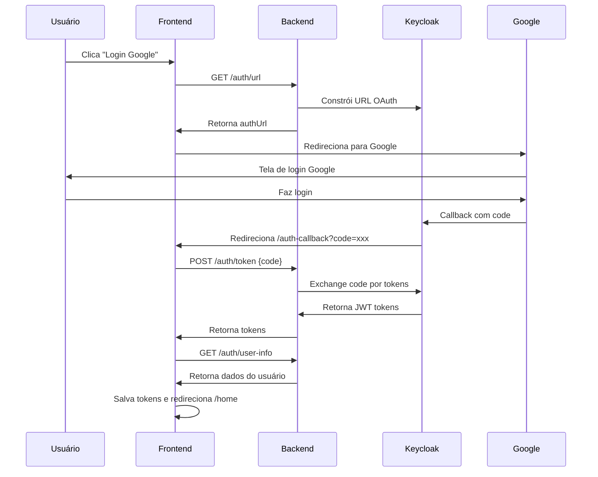

# POC - Autenticação Google via Keycloak

Este projeto é uma prova de conceito (POC) para integração de login social com Google utilizando Keycloak como Identity Provider.

## 🏗️ Arquitetura

```
poc-keycloak/
├── arch/           # Infraestrutura (Docker, Keycloak, PostgreSQL)
├── backend/        # API Spring Boot 3 com Java 21
├── frontend/       # Aplicação Angular 17 standalone
└── README.md       # Esta documentação
```

## 🚀 Tecnologias

### Backend
- **Spring Boot 3** com Java 21
- **Spring Security** para CORS e endpoints
- **Keycloak Integration** com OAuth 2.0
- **Arquitetura SOLID** com services especializados

### Frontend  
- **Angular 17** com standalone components
- **RxJS** para programação reativa
- **Toast System** para notificações
- **Route Guards** para proteção de rotas
- **Modern UI/UX** com animações e responsividade

### Infraestrutura
- **Keycloak** como Identity Provider
- **PostgreSQL** como banco de dados
- **Docker Compose** para orquestração

## 📋 Pré-requisitos

- Docker e Docker Compose
- Java 21
- Node.js 20+
- Maven 3.9+

## 🏃‍♂️ Como executar

### 1. Iniciar a infraestrutura

```bash
cd arch
./scripts/start.sh
```

**Keycloak Admin Console**: http://localhost:8080/admin
- Usuário: `admin` | Senha: `admin`

### 2. Iniciar o Backend

```bash
cd backend
./mvnw spring-boot:run
```

**API Backend**: http://localhost:8081

### 3. Iniciar o Frontend

```bash
cd frontend
npm install
npm start
```

**Aplicação Web**: http://localhost:4200

## ✨ Funcionalidades Implementadas

### ✅ Autenticação OAuth 2.0
- [x] **Google Login** funcional via Keycloak
- [x] **Authorization Code Flow** completo
- [x] **JWT Token Management** (access, refresh, id tokens)
- [x] **Logout** com revogação de tokens

### ✅ Frontend Moderno
- [x] **Tela de login** responsiva e moderna
- [x] **Toast notifications** para feedback do usuário
- [x] **Loading states** durante autenticação
- [x] **Error handling** robusto
- [x] **Route protection** com guards
- [x] **Home dashboard** pós-login

### ✅ Backend Robusto
- [x] **Spring Security** configurado
- [x] **CORS** liberado para desenvolvimento
- [x] **Services especializados** (URL, HTTP, Logout)
- [x] **Error handling** centralizado
- [x] **Clean Architecture** seguindo SOLID

### ✅ Infraestrutura
- [x] **Keycloak** configurado e rodando
- [x] **PostgreSQL** como database
- [x] **Docker containers** orquestrados
- [x] **Scripts** de automação (start/stop/reset)

## 🔧 Configuração OAuth Google

Para funcionar completamente, configure no **Google Cloud Console**:

1. Criar projeto no [Google Cloud Console](https://console.cloud.google.com/)
2. Habilitar **Google+ API**
3. Configurar **OAuth Consent Screen**
4. Criar **OAuth 2.0 Client ID** com:
   - **Authorized redirect URIs**: `http://localhost:8080/realms/master/broker/google/endpoint`
5. Anotar **Client ID** e **Client Secret**
6. No Keycloak Admin, configurar **Identity Provider** Google com as credenciais

## 📊 Fluxo de Autenticação



## 📁 Estrutura de Arquivos Principais

```
backend/src/main/java/com/example/backend/
├── config/
│   ├── SecurityConfig.java       # Configuração Spring Security
│   ├── CorsConfig.java          # Configuração CORS
│   └── KeycloakProperties.java  # Properties do Keycloak
├── controller/
│   └── AuthorizationController.java # Endpoints de auth
├── service/
│   ├── AuthorizationService.java    # Service principal
│   ├── KeycloakUrlService.java     # Construção URLs
│   ├── KeycloakHttpClient.java     # HTTP requests
│   └── KeycloakLogoutService.java  # Logout logic
└── integration/
    └── KeycloakIntegration.java    # Facade pattern

frontend/src/app/
├── login/
│   ├── login.component.ts          # Componente de login
│   ├── login.component.html        # Template moderno
│   ├── login.component.scss        # Estilos responsivos
│   └── service/login.service.ts    # Service de autenticação
├── auth-callback/
│   └── auth-callback.component.ts  # Handler do callback
├── home/
│   └── home.component.ts          # Dashboard pós-login
├── shared/services/
│   └── toast.service.ts           # Sistema de notificações
├── auth.guard.ts                  # Proteção de rotas
└── login.guard.ts                 # Redirecionamento se logado
```

## 🔍 Endpoints da API

| Método | Endpoint | Descrição |
|--------|----------|-----------|
| `GET` | `/auth/url` | Obter URL de autenticação Google |
| `POST` | `/auth/token` | Trocar code por tokens JWT |
| `GET` | `/auth/user-info` | Obter informações do usuário |
| `POST` | `/auth/logout` | Fazer logout e revogar tokens |

## 📚 Documentação Adicional

- [Configuração de Infraestrutura](./arch/README.md)
- [Documentação do Backend](./backend/README.md)
- [Documentação do Frontend](./frontend/README.md)

## 🤝 Contribuição

Este é um projeto de demonstração (POC). Sinta-se livre para usar como base para seus próprios projetos de autenticação OAuth.